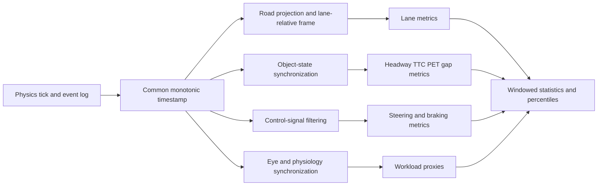
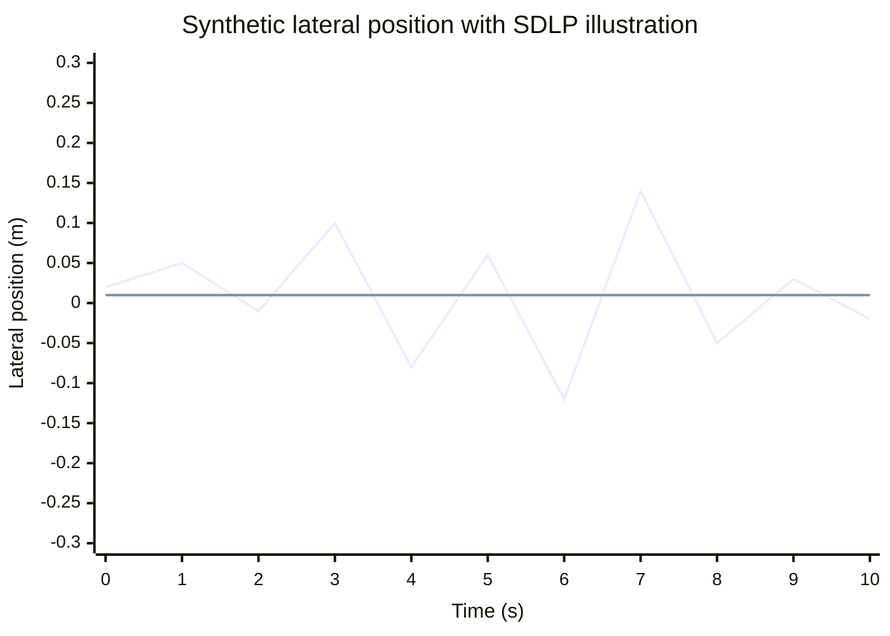

# Driving Performance Metrics in Research

## Executive Summary

Across human-factors, traffic-safety, impairment, and driving-simulator research, the most repeatedly used driving-performance metrics cluster into four families: lane-position metrics such as lateral position and standard deviation of lane position; longitudinal and interaction metrics such as time gap, time headway, time to collision, and time to line crossing; steering-control metrics such as steering reversal rate and steering entropy; and event- or response-based metrics such as lane departures, reaction time, brake response, and collision outcomes. Recent NHTSA review work found SDLP to be the single most common lane-keeping metric across impairment studies, with standard deviation of speed also widely used; event-based lane-crossing and lane-departure measures were less frequent than SDLP but more directly safety-critical. citeturn6view0turn9view7

The most important methodological point is that these metrics are **not interchangeable**. SDLP is a dispersion metric, mean lateral position is a bias metric, TLC is a forward-looking safety-margin metric, TTC is a closing-conflict metric, and steering entropy is a workload-sensitive predictability metric rather than a direct crash proxy. A rigorous simulator study therefore needs to report the exact operational definition, coordinate frame, event boundaries, and preprocessing choices used for every metric, which is the motivation behind SAE J2944-style definitions and reporting guidance. citeturn22view2turn22view4turn27view1turn27view2turn25view3

There are a few literature anchors that are useful in practice, but there are **fewer universal thresholds than many teams assume**. Typical alert-driver SDLP is on the order of **0.20 m** in the SAE guidance literature, while an **increase** in SDLP of about **2.4 cm** relative to placebo is widely used as an alcohol-calibrated impairment benchmark corresponding to about **BAC 0.05%** in the standardized on-road test literature. For time-based interaction measures, research and standards discussions often use TTC thresholds around **3–4 s** for uncomfortable or safety-critical approach situations, while lane-departure-warning research repeatedly points to a TLC warning threshold around **1.0 s** as a practical balance between usefulness and nuisance alarms. Headway norms are even more context-dependent: naturalistic time gaps often center around **1.0–1.4 s**, but shorter headways are associated with higher workload and lower safety margins, and many applied safety recommendations remain closer to **2–3 s**. citeturn22view2turn35search0turn35search12turn35search13turn7view2turn27view3turn16view0turn27view1turn18view0turn4search12

For implementation in a three.js-based simulator, the decisive engineering requirement is to separate the **physics/telemetry clock** from the render clock and to compute metrics in a **road-relative frame**. Lane measures require reliable projection of ego position to a lane centerline or spline; TTC and headway require synchronized object-state trajectories; response-time metrics require event markers; steering entropy requires baseline trials and resampling conventions; pupil and HRV measures require separate sensor streams and careful synchronization. If those prerequisites are met, nearly all common research metrics are straightforward to compute reproducibly from world pose, lane geometry, controls, and object states. citeturn22view1turn12view0turn27view2turn24view0turn23view0turn25view4turn36search3turn17search16

A practical default for unspecified simulators is to log vehicle/object telemetry at **20–60 Hz**, steering/pedals at **50–100 Hz** or higher, eye tracking at **at least 60 Hz** if workload proxies are needed, and ECG at **250 Hz** when HRV is a target outcome; then resample metric-specific signals as required by the literature, such as the 7 Hz or 4 Hz steering-entropy pipelines. Those defaults are not universal standards, but they align well with the computational assumptions in the core literature summarized here. citeturn24view0turn8view1turn37view4turn36search3turn17search16

## Scope, Assumptions, and Data Architecture

This report assumes that the simulator’s exact frame rate is unspecified, so all procedures are written against a **monotonic simulation timestamp** rather than a render-frame index. I also assume that the simulator can provide, or you can derive, a lane centerline or path reference; lane boundaries or lane width; ego pose and velocity; control inputs; object states for relevant targets; and event markers for experimental stimuli. That assumption is consistent with how standardized driving measures are defined in SAE J2944 and with how NHTSA simulator analyses synchronize vehicle and behavioral streams before reduction. citeturn22view1turn25view4turn21search23

The cleanest abstraction uses three coordinate frames. In the **world frame**, you store raw simulator outputs: position \((x,y,z)\), yaw, pitch, roll, velocities, and object poses. In the **road-relative frame**, you project the ego vehicle onto the nearest lane-centerline point and compute tangent \(\hat t\), normal \(\hat n\), and curvature \(\kappa\). In the **vehicle body frame**, you keep steering angle, longitudinal and lateral velocities, pedal positions, and body-fixed accelerations. Lane metrics are usually defined in the road-relative frame; steering and pedal metrics in the body/control frame; and TTC/headway in either lane-relative one-dimensional form or full world-trajectory form, depending on the scenario. SAE guidance explicitly warns that path definition matters on curves, because poor lane-boundary geometry can materially distort SDLP and related lane-position measures. citeturn22view1turn22view2

A robust telemetry schema is therefore:

| Signal | Typical notation | Why it is needed | Suggested raw rate | Notes |
|---|---|---|---|---|
| Timestamp | \(t_i\) | All metrics | simulator tick | Must be monotonic and shared across streams |
| Ego position/orientation | \(p_i=(x,y,z), \psi_i\) | Lane position, TLC, collisions | 20–60 Hz | World frame |
| Ego speed/velocity | \(v_i, \dot p_i\) | Speed, headway, TTC, TLC | 20–60 Hz | Derive from physics, not render delta |
| Ego acceleration | \(a_i\) | TTC with acceleration, jerk, braking | 20–60 Hz | Prefer physics engine output over noisy differentiation |
| Steering wheel angle | \(\theta_i\) | SRR, steering entropy, variability | 50–100 Hz+ | J2944 examples sample every 15–50 ms before resampling citeturn24view0 |
| Accelerator/brake position or pressure | \(u_a, u_b\) | Response/braking metrics | 50–100 Hz+ | Needed for release, contact, pressure thresholds |
| Lane centerline and boundaries | \(C(s), w(s)\) | Lateral position, SDLP, departures, TLC | static + segment index | Use spline or dense polyline |
| Target object states | \(p^j_i, v^j_i, a^j_i\) | TTC, headway, PET, DRAC | 20–60 Hz | Same time base as ego |
| Collision/contact events | event log | Collision count/rate, severity | event-based | Keep exact timestamps and IDs |
| Eye tracking or pupil size | \(PD_i\) | Workload proxies | 60 Hz+ common in simulator setups citeturn36search3 | Higher is better near blinks/saccades |
| ECG/PPG intervals | RR / IBI | HR, RMSSD, SDNN | 250 Hz preferred; 100 Hz acceptable for time-domain-only HRV citeturn17search16 | Prefer ECG if available |
| Stimulus/event markers | \(t_{\text{event}}\) | Reaction/brake response | event-based | Must be logged in the same clock domain |

The preprocessing pipeline should be deterministic and logged in the methods section. A good default is: synchronize all streams to a common clock; resample to uniform time steps where needed; screen out impossible values; interpolate only short gaps; low-pass filter noisy control signals before derivative-based event detection; compute lane projection in a road-relative frame; then segment the drive by scenario, road geometry, speed zone, or event window. The steering-entropy literature is especially explicit that raw steering should be filtered and resampled before prediction-error analysis, and pupillometry literature is equally explicit that artifact removal should come **before** baseline correction. citeturn24view0turn8view1turn39search1turn39search4



## Lane, Speed, and Steering Metrics

The lane-keeping family remains the backbone of simulator research. The accessible SAE J2944 draft defines **lateral lane position**, **mean lateral position**, **SDLP**, lane-departure count, lane-departure duration, and magnitude of departure, while NHTSA’s 2023 review confirms that SDLP is the most common lane-position metric in simulator impairment studies. Steering metrics are less universal but especially valuable in distraction and workload studies, with steering reversal rate and steering entropy standing out as the most established options. citeturn22view1turn22view2turn26view0turn26view1turn26view2turn22view4turn6view0turn9view7

The core formulas are as follows.

**Signed lateral position** \(LP_i\). Let \(c_i\) be the nearest point on a lane centerline or reference path, and \(\hat n_i\) the local road-normal unit vector. Then:

\[
LP_i = \hat n_i \cdot (p_i - c_i)
\]

Units are meters. The sign convention must be reported. On curves, using the geometric middle of a chorded lane approximation can bias the result; a spline or path-driven reference is preferable. In naturalistic data cited by SAE, mean lateral offsets are roughly **5 cm left in daylight** and **12 cm left at night**, illustrating that mean position reflects bias, not variability. Statistical variants: mean, median, SD, IQR, quartiles, and segment-specific percentiles. citeturn22view1

**Lane deviation**. This term is used inconsistently in the literature, so you should define it explicitly. In simulator work, the most reproducible choices are mean absolute lateral deviation

\[
MAD_{LP} = \frac{1}{N}\sum_{i=1}^{N}|LP_i|
\]

or RMS lateral deviation

\[
RMS_{LP} = \sqrt{\frac{1}{N}\sum_{i=1}^{N}LP_i^2}
\]

Units are meters. There is no universal threshold; route geometry and lane width dominate. Because the term is ambiguous, report the exact reference path and whether the statistic is signed, absolute, or squared. That recommendation follows directly from the reporting problems that J2944 was created to reduce. citeturn22view1turn22view2

**Mean lateral position**

\[
\bar{LP} = \frac{1}{N}\sum_{i=1}^{N} LP_i
\]

Units are meters. Use it to quantify systematic lane bias, apex-cutting on curves, or lane-position shift under workload or impairment. Statistical variants: mean, median, trimmed mean, percentile bands. Typical values are highly route-dependent, but the SAE-cited naturalistic offsets above are useful anchors. citeturn22view1

**Standard deviation of lane position**

\[
SDLP = \sqrt{\frac{1}{N-1}\sum_{i=1}^{N}(LP_i-\bar{LP})^2}
\]

The unbiased sample estimator is specifically recommended in the SAE guidance. Units are meters. A typical alert-driver SDLP is about **0.20 m** in the literature cited by that guidance, while alcohol-calibration work repeatedly uses a **change** of about **+0.024 m** relative to placebo as the clinically relevant impairment threshold corresponding to about **BAC 0.05%**. Because absolute SDLP depends on road type, simulator dynamics, and path geometry, studies often report both absolute SDLP and \(\Delta SDLP\) relative to baseline or placebo. Statistical variants: mean SDLP across segments, per-subject SDLP, robust SDLP after outlier trimming, percentile envelopes of \(|LP|\). citeturn22view2turn35search0turn35search12turn35search13

**Lane departure count and lane-keeping failure**. J2944 defines a lane departure as the count of occasions when some part of the vehicle is no longer in the travel lane, with several start/end options depending on whether you use the widest body point, front tire, any tire, inside edge, outside edge, or full tire excursion. In implementation terms, lane-keeping failure is usually a stricter binary/event variant of the same concept:

\[
\text{departure}_i = \mathbb{1}\!\left(|LP_i| + b_{\text{veh}} > \frac{w_{\text{lane},i}}{2}\right)
\]

where \(b_{\text{veh}}\) is half vehicle width. Count event starts, not every sample. Report rate per hour, per 100 km, per scenario, or per 100 miles. SAE-cited field data place light-vehicle lane-departure rates in the rough range of **7.1 to 9.2 per 100 miles** in baseline conditions depending on road type, with lane-departure duration commonly **less than 2 s** and a modal departure magnitude around **6 cm**. Those are not universal norms, but they are valuable anchors for realism checks in synthetic scenarios. citeturn26view0turn26view1turn26view2

**Speed and speed variability**

\[
\bar v = \frac{1}{N}\sum_{i=1}^{N} v_i,\qquad
SDS = \sqrt{\frac{1}{N-1}\sum_{i=1}^{N}(v_i-\bar v)^2}
\]

with units m/s or km/h. Many studies also use speed relative to speed limit, \(\bar v - v_{\text{limit}}\), or percentages above/below a threshold. Brown’s 2023 review found standard deviation of speed to be one of the most commonly reported speed metrics across simulator impairment studies, but unlike SDLP it has few cross-study normative thresholds because it is strongly route- and task-dependent. Statistical variants: mean, median, SD, IQR, percent above threshold, speed-profile percentiles. citeturn28view0

**Steering reversal rate**. After low-pass filtering the steering angle signal, count directional reversals exceeding an amplitude threshold \(\Delta a\) within a moving time window \(\Delta t\), then divide by duration or by distance:

\[
SRR = \frac{N_{\text{reversal}}}{T_{\text{window}}}
\quad \text{or} \quad
SRR_d = \frac{N_{\text{reversal}}}{D}
\]

Units are reversals/min or reversals/km. J2944’s appendix reproduces an AIDE algorithm that low-pass filters steering with a **second-order Butterworth at 0.6 Hz** and uses a **3°** gap size in its illustrative algorithm. More recent work shows that parameter choice matters: **0.5°** reversals are sensitive to cognitive load, while gap sizes in the **2–4°** range work well for visual load in straight-road conditions, and **0.1–0.5°** can be optimal for cognitive-task sensitivity. There is no universal “normal SRR” number; the parameterization is the normatively important part. citeturn29view1turn29view4turn7view1turn7view7turn7view8turn12view1

**Steering entropy**. Steering entropy quantifies how unpredictable the steering profile becomes relative to a baseline steering model. In the classic 1999 form, steering angle is sampled every **15–50 ms**, then resampled to about **150 ms** (\(\sim 7\) Hz), a second-order Taylor predictor is used,

\[
\theta_p(n) = \frac{5}{2}\theta(n-1) - 2\theta(n-2) + \frac{1}{2}\theta(n-3),
\]

prediction error is

\[
e(n)=\theta_p(n)-\theta(n),
\]

and entropy is computed over bins of the prediction-error distribution. In the improved 2005 method, the preferred implementation fits a third-order AR model to a baseline segment, computes baseline-reference prediction errors, defines baseline bins and probabilities, and evaluates a weighted entropy of evaluation-condition counts against those baseline probabilities. A practical implementable form is

\[
H = -\frac{1}{N_{\text{eval}}}\sum_{k=1}^{K} n^{\text{eval}}_k \log_2\!\big(\max(p^{\text{base}}_k,10^{-3})\big)
\]

where \(n_k^{eval}\) are evaluation-window counts in baseline-defined bin \(k\), and \(p_k^{base}\) are baseline bin probabilities. The 2005 literature and J2944 recommend approximately **4 Hz** resampling, **\(\alpha = 0.2\)**, and **\(K=14\)** bins, and the SAE guidance reports typical baseline values around **0.4**. Statistical variants are usually trial-level means or condition contrasts rather than per-sample summaries. citeturn24view0turn23view4turn23view0turn37view3turn37view4turn22view4turn9view4

A reproducible lane/steering workflow is:

1. Project each ego pose to the lane reference and compute signed lateral offset.
2. Exclude samples in which the lane model is undefined; do not silently backfill across geometry discontinuities.
3. For SDLP and lane-bias metrics, compute statistics separately for homogeneous segments: straight vs curve, with vs without traffic, constant-speed zones, takeover windows, and so on.
4. For departure metrics, convert samplewise threshold violations into event intervals and compute count, duration, and magnitude per interval.
5. For speed metrics, use raw or physics-provided speed, not numerical derivatives of noisy position if avoidable.
6. For SRR, low-pass filter steering before finding stationary points and reversals.
7. For steering entropy, collect a clean baseline first; without a baseline there is no principled entropy reference. citeturn22view2turn26view1turn29view1turn24view0turn23view0

```js
// JavaScript-friendly utilities for lane, speed, and steering metrics.

function finiteValues(xs) {
  return xs.filter(Number.isFinite);
}

function mean(xs) {
  const ys = finiteValues(xs);
  if (!ys.length) return NaN;
  return ys.reduce((a, b) => a + b, 0) / ys.length;
}

function sampleSD(xs) {
  const ys = finiteValues(xs);
  if (ys.length < 2) return NaN;
  const m = mean(ys);
  const ss = ys.reduce((s, x) => s + (x - m) ** 2, 0);
  return Math.sqrt(ss / (ys.length - 1));
}

function interpolateShortNaNGaps(xs, maxGapSamples = 3) {
  const out = xs.slice();
  let i = 0;
  while (i < out.length) {
    if (Number.isFinite(out[i])) { i++; continue; }
    const start = i - 1;
    let j = i;
    while (j < out.length && !Number.isFinite(out[j])) j++;
    const gap = j - i;
    const hasBounds = start >= 0 && j < out.length &&
      Number.isFinite(out[start]) && Number.isFinite(out[j]);
    if (hasBounds && gap <= maxGapSamples) {
      for (let k = 1; k <= gap; k++) {
        out[start + k] = out[start] + (out[j] - out[start]) * (k / (gap + 1));
      }
    }
    i = j;
  }
  return out;
}

// laneProject(pointWorld, lanePolyline) is assumed to return:
// { center: {x, y, z}, tangent: {x, y, z}, normal: {x, y, z}, laneWidthM }
function signedLateralOffset(pointWorld, laneProj) {
  const dx = pointWorld.x - laneProj.center.x;
  const dy = pointWorld.y - laneProj.center.y;
  const dz = pointWorld.z - laneProj.center.z;
  return dx * laneProj.normal.x + dy * laneProj.normal.y + dz * laneProj.normal.z;
}

function computeLaneStats(offsetsM) {
  const clean = interpolateShortNaNGaps(offsetsM, 2);
  return {
    meanLP: mean(clean),
    medianLP: (() => {
      const ys = finiteValues(clean).sort((a, b) => a - b);
      if (!ys.length) return NaN;
      const mid = Math.floor(ys.length / 2);
      return ys.length % 2 ? ys[mid] : 0.5 * (ys[mid - 1] + ys[mid]);
    })(),
    MADLP: mean(clean.map(v => Number.isFinite(v) ? Math.abs(v) : NaN)),
    SDLP: sampleSD(clean)
  };
}

function detectLaneDepartures(offsetsM, laneWidthsM, vehicleHalfWidthM) {
  const events = [];
  let inEvent = false;
  let start = -1;
  let maxMag = 0;

  for (let i = 0; i < offsetsM.length; i++) {
    if (!Number.isFinite(offsetsM[i]) || !Number.isFinite(laneWidthsM[i])) continue;
    const margin = laneWidthsM[i] / 2 - vehicleHalfWidthM;
    const violation = Math.abs(offsetsM[i]) > margin;

    if (violation && !inEvent) {
      inEvent = true;
      start = i;
      maxMag = Math.abs(offsetsM[i]) - margin;
    } else if (violation && inEvent) {
      maxMag = Math.max(maxMag, Math.abs(offsetsM[i]) - margin);
    } else if (!violation && inEvent) {
      events.push({ startIndex: start, endIndex: i - 1, maxMagnitudeM: maxMag });
      inEvent = false;
    }
  }
  if (inEvent) {
    events.push({ startIndex: start, endIndex: offsetsM.length - 1, maxMagnitudeM: maxMag });
  }
  return events;
}

function computeSpeedStats(speedMs) {
  return { meanSpeedMs: mean(speedMs), sdSpeedMs: sampleSD(speedMs) };
}

// For SRR, replace lowPass() with a proper DSP implementation (e.g., 2nd-order Butterworth).
function findTurningPoints(xs) {
  const pts = [];
  for (let i = 1; i < xs.length - 1; i++) {
    if (!Number.isFinite(xs[i - 1] + xs[i] + xs[i + 1])) continue;
    const up = xs[i] > xs[i - 1] && xs[i] >= xs[i + 1];
    const dn = xs[i] < xs[i - 1] && xs[i] <= xs[i + 1];
    if (up || dn) pts.push(i);
  }
  return pts;
}

function steeringReversalRate(steerDegLPF, dtSec, gapDeg = 3) {
  const tp = findTurningPoints(steerDegLPF);
  let reversals = 0;
  for (let i = 1; i < tp.length; i++) {
    const amp = Math.abs(steerDegLPF[tp[i]] - steerDegLPF[tp[i - 1]]);
    if (amp >= gapDeg) reversals++;
  }
  const minutes = (steerDegLPF.length * dtSec) / 60;
  return minutes > 0 ? reversals / minutes : NaN;
}

// Baseline-referenced approximate 2005 steering entropy.
function steeringEntropyApprox(evalPE, baselineBins, baselineProb) {
  const counts = new Array(baselineProb.length).fill(0);
  let n = 0;
  for (const e of evalPE) {
    if (!Number.isFinite(e)) continue;
    let k = baselineBins.findIndex((b, idx) =>
      idx < baselineBins.length - 1 && e >= b && e < baselineBins[idx + 1]
    );
    if (k === -1) k = e < baselineBins[0] ? 0 : baselineBins.length - 2;
    counts[k]++;
    n++;
  }
  if (!n) return NaN;
  let H = 0;
  for (let k = 0; k < counts.length; k++) {
    if (counts[k] === 0) continue;
    H += counts[k] * Math.log2(Math.max(baselineProb[k], 1e-3));
  }
  return -H / n; // bits
}
```

The chart below is a **synthetic illustration** of lateral position over a short segment. The example values have mean near zero and a synthetic \(SDLP \approx 0.15\) m, which is within the broad order of magnitude seen in alert-driver lane-keeping, but the chart is presented only to illustrate the computation.



## Interaction, Safety, and Response Metrics

If lane metrics tell you how well the driver controlled the vehicle, interaction metrics tell you **how much safety margin remained**. The most common research metrics here are time gap, time headway, TTC, TLC, gap acceptance, PET, response time, brake-response variants, and collision or near-collision counts. J2944 treats these as conceptually distinct and explicitly warns that the term “headway” is often misused in the literature to mean either gap or headway. citeturn27view0turn27view1turn27view2

**Time gap and time headway**. In following scenarios, let \(R_i\) be bumper-to-bumper range and \(v_{ego,i}\) ego speed. Then bumper-to-bumper time gap is

\[
TG_i = \frac{R_i}{v_{ego,i}}, \qquad v_{ego,i} > 0
\]

and center-of-gravity time headway is

\[
THW_i = \frac{d_{cg,i}}{v_{ego,i}}, \qquad v_{ego,i} > 0
\]

where \(d_{cg}\) is center-to-center longitudinal spacing. Units are seconds. In SAE-cited on-road data at speeds above 25 mph, time gaps ranged roughly **0.3 to 3.0 s**, with **median about 1.4 s** and **mode about 1.0 s**; urban studies cited there gave roughly **1.4 to 2.2 s**. In automated/manual car-following work, drivers report meaningfully higher workload when lead-vehicle THW is **1.0 s or less** compared with **1.5 s or more**. For safety advice rather than descriptive behavior, several applied studies continue to recommend **2–3 s**. Statistical variants: mean, median, 5th percentile, minimum, proportion below threshold, and event minima per car-following episode. citeturn27view1turn18view0turn4search12

**Time to collision**. In one-dimensional constant-velocity following,

\[
TTC = \frac{R}{v_{ego}-v_{lead}}
\]

when \(v_{ego} > v_{lead}\); otherwise \(TTC = \infty\). In constant-acceleration form, solve

\[
R - v_{rel}t - \frac{1}{2}a_{rel}t^2 = 0
\]

for the smallest positive root, where \(v_{rel}=v_{ego}-v_{lead}\) and \(a_{rel}=a_{ego}-a_{lead}\). Units are seconds. TTC is undefined or infinite when collision is impossible under the current-motion assumption. J2944’s synthesis cites **4 s** as a boundary between safe and uncomfortable situations in some road studies, **3 s** as an adequate TET threshold in others, and **2.6 s** as a minimum TTC for ACC-equipped drivers in one cited study. Conflict-analysis literature often uses more aggressive thresholds such as **1.5 s** for severe conflicts, especially outside simple car-following. Statistical variants: minimum TTC per episode, median TTC within exposure windows, and proportions below thresholds. citeturn26view3turn27view3turn33search2turn33search17

**Time exposed TTC and time integrated TTC**. These are threshold-based aggregate surrogates. For threshold \(TTC^\*\),

\[
TET = \int \mathbb{1}[0 \le TTC(t) \le TTC^\*]\,dt
\]

with units s, and

\[
TIT = \int \max(0, TTC^\* - TTC(t))\,dt
\]

with units s\(^2\). In discrete time with step \(\Delta t\), compute the corresponding sums. These measures are useful when minimum TTC alone is too brittle, especially in mixed crash/non-crash datasets or long exposures. Common threshold choices in the accessible standards text are **3 s** and **4 s**, but you should always report the threshold explicitly. citeturn27view3turn27view4turn27view5

**Time to line crossing**. In its exact form, TLC is the distance to line crossing along the vehicle’s predicted path divided by vehicle speed. The accessible J2944 appendix provides a practical field approximation:

\[
TLC = \frac{LP_{\text{right}}}{LV + LA}\quad \text{if } LA < 0
\]
\[
TLC = \frac{LP_{\text{left}}}{LV + LA}\quad \text{if } LA > 0
\]

where \(LP_{right}\) and \(LP_{left}\) are lateral distances from wheel to lane marking, \(LV\) is lateral velocity relative to the road, and \(LA\) is lateral acceleration. The same appendix says the approximate metric is undefined when \(LA=0\), when the vehicle is already outside the lane, or when the resulting TLC exceeds **20 s** in the HASTE-style implementation. Another SAE note points out that the frequently used simplified approximation “lateral distance divided by lateral speed” tends to **overestimate** TLC minima because it assumes constant lateral velocity. For warning design, a large European review found that about **1.0 s** is a practical warning threshold, while cited studies suggest drivers need roughly **0.9 s or more** to successfully avoid lane departure. Statistical variants: local minima, minimum TLC per event, proportion of time below threshold, and threshold-exposure duration. citeturn12view0turn22view3turn12view1turn16view0

**Gap acceptance and critical gap**. For a gap \(g_j\) in a conflicting traffic stream and a binary decision \(A_j \in \{0,1\}\) to accept or reject, the simplest probabilistic model is

\[
P(A=1 \mid g)=\frac{1}{1+\exp[-(\beta_0+\beta_1 g)]}
\]

and the 50% acceptance critical gap is

\[
g_{50} = -\frac{\beta_0}{\beta_1}
\]

if \(\beta_1>0\). In classical unsignalized-intersection theory, the critical gap is the minimum usable gap a driver is prepared to accept. FHWA’s traffic-flow theory chapter uses **4 s** as a simple illustrative example, but historical and contemporary field values are often higher and maneuver-specific; a recent naturalistic study reported average critical gaps of about **5.25 s for right turns** and **6.19 s for left turns**. Under Raff’s method, the critical gap is the time \(t_c\) at which the cumulative fraction of accepted gaps shorter than \(t_c\) equals the cumulative fraction of rejected gaps longer than \(t_c\), often written \(F_a(t_c) = 1 - F_r(t_c)\). Statistical variants: mean/median accepted gap, critical-gap estimate by method, gap-acceptance probability curves, and follow-up time \(t_f\). citeturn12view3turn14view0turn14view2turn30search3turn31search12turn31search14

**Post-encroachment time**. For crossing and merging conflicts, PET is

\[
PET = t_{\text{arrive, second}} - t_{\text{leave, first}}
\]

measured at the same conflict point or conflict zone. Units are seconds. FHWA defines PET as the time between the first road user ending encroachment and the second arriving at the potential collision point. PET equals zero at collision. Thresholds vary substantially by scenario, but recent review work reports **1.0 s** as a common critical-conflict threshold, with some literature using **1.5 s**. PET is especially useful for intersection and lane-change conflicts where TTC assumptions are geometrically awkward. Statistical variants: minimum PET per conflict, PET distributions by conflict class, and proportions below threshold. citeturn9view6turn33search9turn33search2turn33search17

**Reaction time and brake-response metrics**. SAE distinguishes generic reaction time from event-specific pedal/brake measures. A general reaction time is

\[
RT = t_{\text{first hand/foot movement}} - t_{\text{event onset}}
\]

while brake response time is the interval to first brake contact, a specified pedal movement, brake-lamp onset, 25% of maximum brake pressure, or brake jerk crossing a threshold. One threshold explicitly cited in the accessible SAE draft is **10 m/s\(^3\)** for the brake-jerk endpoint. The same source reports accelerator-release response times around **0.96–1.26 s** in simulator/test-track work, movement times as short as **0.15–0.20 s** in alerted braking tasks depending on definition, and warns that inconsistent endpoint definitions can change movement-time estimates dramatically. FHWA’s human-factors synthesis gives brake PRT percentiles of roughly **1.18 s median, 1.87 s 85th percentile, and 2.45 s 95th percentile** for surprise braking, versus much shorter expected-braking values; crash-reconstruction practice often uses **1.5 s** as a broad perception-response assumption. Statistical variants: median, survival/censoring statistics, inverse-time transforms for no-response trials, and per-endpoint distributions. citeturn25view0turn25view2turn25view3turn25view4turn13view0turn13view3

**Collision count, collision rate, and severity proxies**. The simple forms are

\[
CR_T = \frac{N_{collisions}}{T}, \qquad
CR_D = \frac{N_{collisions}}{D}
\]

with units collisions/h or collisions/km. In simulator studies, collision counts are often too sparse for stable inference, so they are commonly paired with proxy metrics such as minimum TTC, adjusted minimum TTC, PET, lane-departure counts, delta-v, peak deceleration, or DRAC. The SAE-adjusted-TTC discussion explicitly motivates that pairing: it was designed to incorporate both crash and non-crash outcomes in one analyzable metric. A practical severity proxy at impact is relative speed or \(\Delta v\), depending on the simulator’s contact model. citeturn26view3turn34view2

A reproducible interaction/safety workflow is:

1. Match the ego vehicle to a lead vehicle or conflict object with the same timestamp, not nearest render frame.
2. Compute state variables in a scenario-appropriate frame: one-dimensional along-lane for following, geometric conflict-zone logic for crossings/merges.
3. Handle nonclosing states explicitly by returning \(+\infty\) for TTC/TG/THW where appropriate.
4. Convert samplewise threshold crossings to episode-level minima and exposure durations.
5. For response-time metrics, define onset and end-point signals before collection begins.
6. For no-response trials, treat time as censored rather than writing a huge arbitrary constant. SAE explicitly recommends considering inverse-time formulations if no-response trials occur. citeturn27view0turn25view3

```js
function timeGap(rangeM, egoSpeedMs) {
  if (!Number.isFinite(rangeM) || !Number.isFinite(egoSpeedMs) || egoSpeedMs <= 0) return Infinity;
  return rangeM / egoSpeedMs;
}

function ttc1D(rangeM, egoSpeedMs, leadSpeedMs, egoAccMs2 = 0, leadAccMs2 = 0) {
  if (!Number.isFinite(rangeM) || rangeM <= 0) return 0;
  const vRel = egoSpeedMs - leadSpeedMs;
  const aRel = egoAccMs2 - leadAccMs2;

  // Constant-velocity fallback.
  if (Math.abs(aRel) < 1e-6) {
    return vRel > 0 ? rangeM / vRel : Infinity;
  }

  // Solve 0.5*aRel*t^2 + vRel*t - range = 0
  const A = 0.5 * aRel, B = vRel, C = -rangeM;
  const disc = B * B - 4 * A * C;
  if (disc < 0) return Infinity;
  const r1 = (-B - Math.sqrt(disc)) / (2 * A);
  const r2 = (-B + Math.sqrt(disc)) / (2 * A);
  const roots = [r1, r2].filter(t => t > 0 && Number.isFinite(t)).sort((a, b) => a - b);
  return roots.length ? roots[0] : Infinity;
}

function tetTit(ttcSeriesSec, dtSec, thresholdSec = 3) {
  let tet = 0, tit = 0;
  for (const ttc of ttcSeriesSec) {
    if (!Number.isFinite(ttc)) continue;
    if (ttc >= 0 && ttc <= thresholdSec) {
      tet += dtSec;
      tit += (thresholdSec - ttc) * dtSec;
    }
  }
  return { TET: tet, TIT: tit };
}

function approxTLC(lpLeftM, lpRightM, lateralVelMs, lateralAccMs2) {
  if (!Number.isFinite(lateralAccMs2) || Math.abs(lateralAccMs2) < 1e-9) return undefined;
  if (lateralAccMs2 < 0) {
    return lpRightM >= 0 ? lpRightM / (lateralVelMs + lateralAccMs2) : undefined;
  }
  return lpLeftM >= 0 ? lpLeftM / (lateralVelMs + lateralAccMs2) : undefined;
}

function pet(tFirstLeaves, tSecondArrives) {
  if (!Number.isFinite(tFirstLeaves) || !Number.isFinite(tSecondArrives)) return NaN;
  return Math.max(0, tSecondArrives - tFirstLeaves);
}

function logitCriticalGap(beta0, beta1) {
  if (!Number.isFinite(beta0) || !Number.isFinite(beta1) || beta1 <= 0) return NaN;
  return -beta0 / beta1;
}

function reactionTime(eventTime, samples, predicate) {
  // samples: [{t, value}, ...] sorted by t
  const hit = samples.find(s => s.t >= eventTime && predicate(s.value));
  return hit ? hit.t - eventTime : Infinity; // treat later as censored if no response
}

function collisionRate(numCollisions, distanceKm, durationHr) {
  return {
    perKm: distanceKm > 0 ? numCollisions / distanceKm : NaN,
    perHour: durationHr > 0 ? numCollisions / durationHr : NaN
  };
}
```

## Workload Proxies and Multimodal Metrics

Workload metrics sit partially outside classical vehicle control, but they are widely used in modern driving research because many studies care about **how hard the task feels to the driver**, not just whether the vehicle stayed in lane. Eye-based measures, heart-based measures, skin conductance, blink behavior, and subjective ratings such as NASA-TLX are common complements to vehicle-state data. Recent driving work shows that pupil diameter and pupil-diameter variability can track workload around takeovers and short-headway conditions, while heart rate and short-window HRV metrics can discriminate higher from lower cognitive-load driving stages. citeturn18view0turn19view3turn6view8turn40view0

**Pupil diameter**. The simplest forms are mean pupil diameter in a window and baseline-corrected pupil dilation:

\[
\Delta PD_i = PD_i - \tilde{PD}_{baseline}
\]

where \(PD_i\) is pupil diameter in mm or pixels and \(\tilde{PD}_{baseline}\) is a pre-event baseline, often a mean or median from a short reference interval. For longer monitoring windows, the **standard deviation of pupil diameter** can be especially informative:

\[
SDPD = \sqrt{\frac{1}{N-1}\sum_{i=1}^{N}(PD_i-\overline{PD})^2}
\]

There is **no universal absolute threshold** for workload, because pupil size is strongly affected by luminance, gaze angle, individual physiology, and display geometry. That is why the best practice in the literature is within-subject comparison, artifact removal before baselining, and where possible some form of luminance correction or controlled illumination. Simulator studies explicitly note that pupil diameter is sensitive to both cognitive load and light reflex, and recent work found that mean pupil diameter increased around takeovers while SD of pupil diameter captured workload fluctuations during monitoring. citeturn36search7turn39search1turn39search4turn18view0turn19view3

**Blink metrics**. Blink frequency, blink duration, and blink rate are often used alongside pupil size:

\[
BlinkRate = 60 \cdot \frac{N_{blinks}}{T}
\]

with units blinks/min. Directionality is task-dependent; visual demand can suppress blinking, while fatigue and underload can increase long blinks or change blink duration. Because blink behavior is not monotone across all workload manipulations, it is best treated as a complementary rather than standalone workload measure. citeturn19view0turn17search20

**Heart rate and HRV**. Let \(IBI_i\) be inter-beat interval in milliseconds. Then

\[
HR_i = \frac{60{,}000}{IBI_i}
\]

in bpm, and two common short-window HRV measures are

\[
RMSSD = \sqrt{\frac{1}{M-1}\sum_{i=1}^{M-1}(IBI_{i+1}-IBI_i)^2}
\]

and

\[
SDNN = \sqrt{\frac{1}{M-1}\sum_{i=1}^{M}(IBI_i-\overline{IBI})^2}
\]

both in ms. In a large 2024 simulator study, increased cognitive load was associated with **increased HR** and **decreased RMSSD**; RMSSD and mean IBI behaved consistently even in **30 s** windows, whereas SDNN was less stable for short-window workload estimation. The same paper notes that RMSSD is more appropriate for short-term HRV and is reliable on **10–30 s** windows. Again, there is no universal workload threshold; the recommended analysis is within-subject change relative to baseline or lower-load reference conditions. citeturn6view8turn40view0turn40view1

**Sampling and preprocessing for workload signals**. Simulator eye-tracking systems commonly operate at **60 Hz** or more, which is workable for pupil and blink metrics, although higher rates reduce interpolation error around blink boundaries. Pupillometry preprocessing should remove invalid samples and blink-contaminated intervals, optionally pad blink boundaries by roughly **50–200 ms**, interpolate only short gaps, and baseline-correct **after** artifact cleaning. For physiology, ECG sampled at **250 Hz** is generally acceptable for HRV analysis, while **100 Hz** can suffice when frequency-domain precision is not required. These are the main measurement constraints; the actual workload inference should then be made from within-subject contrasts or statistical models rather than absolute thresholds. citeturn36search3turn39search4turn39search1turn17search16

```js
function baselineCorrectPupil(pupilSeries, baselineIndices) {
  const base = mean(baselineIndices.map(i => pupilSeries[i]));
  return pupilSeries.map(v => Number.isFinite(v) ? v - base : NaN);
}

function blinkRate(blinkEvents, durationSec) {
  return durationSec > 0 ? 60 * blinkEvents.length / durationSec : NaN;
}

function heartRateFromIBI(ibiMs) {
  return ibiMs.map(v => Number.isFinite(v) && v > 0 ? 60000 / v : NaN);
}

function rmssd(ibiMs) {
  const xs = finiteValues(ibiMs);
  if (xs.length < 2) return NaN;
  let s = 0;
  for (let i = 0; i < xs.length - 1; i++) s += (xs[i + 1] - xs[i]) ** 2;
  return Math.sqrt(s / (xs.length - 1));
}

function sdnn(ibiMs) {
  return sampleSD(ibiMs);
}
```

In practice, the strongest workload design is multimodal. If you have only simulator telemetry, steering entropy, SRR, response-time dispersion, and very short headway exposure can serve as indirect workload indicators. If you have eye tracking, add mean and SD pupil diameter plus blink metrics. If you have physiology, HR and RMSSD are the most practical additions. If you also collect subjective workload ratings, use them to validate the physiological or vehicle-based proxies rather than replacing them. That hybrid approach is consistent with recent takeover and automated-driving workload studies. citeturn18view0turn6view8turn40view0

## Three.js Implementation, Synthetic Testing, and Comparison

In a three.js simulator, the single biggest implementation decision is to **log at the simulation tick, not at the render loop**. `requestAnimationFrame()` is an output cadence, not a measurement clock. A robust design stores every telemetry sample in typed arrays or append-only chunks keyed by a monotonic timestamp, while expensive metric computations run in a Web Worker or offline analysis step. That design is not a formal requirement from the standards, but it is the most direct way to satisfy the synchronization and signal-consistency demands inherent in the cited metric definitions. citeturn21search23turn22view1turn25view4

For lane metrics, precompute lane centerlines as dense polylines or splines in world coordinates, then keep a spatial index from road segment to candidate centerline spans. At each physics tick, project the ego position to the nearest centerline point, derive tangent and normal, and cache lane-relative coordinates. For TTC and headway, keep object-state maps keyed by object ID with synchronized pose/velocity histories. For steering and pedal metrics, store raw control time series separately from world pose so you do not contaminate steering entropy or response latencies with resampled state estimates. For eye and physiology, use a shared absolute clock and keep per-stream sample-rate metadata so the analysis layer can align windows exactly. These recommendations follow from the distinct data requirements of J2944-style definitions, steering-entropy algorithms, and workload-sensor preprocessing. citeturn22view1turn12view0turn24view0turn39search1turn17search16

A good in-memory JavaScript representation is usually **struct-of-arrays**, not array-of-objects, for long drives:

```js
const telemetry = {
  t: new Float64Array(N),
  egoX: new Float32Array(N),
  egoY: new Float32Array(N),
  egoZ: new Float32Array(N),
  yaw: new Float32Array(N),
  speed: new Float32Array(N),
  accelX: new Float32Array(N),
  accelY: new Float32Array(N),
  steerDeg: new Float32Array(N),
  brake: new Float32Array(N),
  throttle: new Float32Array(N),
  laneOffset: new Float32Array(N), // optional cache
  laneWidth: new Float32Array(N)
};
```

This layout reduces garbage generation and is especially helpful if you want to batch-compute SDLP, TTC profiles, threshold exposures, or windowed summaries over long sequences. For multiple traffic objects, keep a `Map<objectId, ObjectTrack>` where each `ObjectTrack` also uses typed arrays. If memory is constrained, use ring buffers for online metrics and flush segments to IndexedDB or disk. These are engineering recommendations, but they directly support the metrics defined above. citeturn22view1turn27view0turn25view4

Visualization is easiest when it mirrors the semantics of the metric. For lane metrics, show a lane ribbon with a color-coded ego trace and departure markers at event starts. For TTC and headway, use a lead-vehicle strip chart or a short-horizon gauge that turns color when crossing thresholds. For TLC, show left/right predicted boundary intersections and the current minimum TLC. For steering entropy and SRR, a synchronized steering-angle plot with reversal markers is more informative than a scalar dashboard number. For workload, use stacked spark lines for pupil, HR, RMSSD, and steering entropy around event windows. These visualization suggestions are a synthesis of the metric families rather than claims from a single source, but they map directly onto the underlying signal definitions. citeturn22view4turn12view0turn18view0turn40view0

For **synthetic test data**, the most useful approach is to synthesize each metric family from a latent scenario state and then inject controlled corruption:

- For lane control, generate a smooth reference path, then add Ornstein–Uhlenbeck or AR(1) lateral noise plus occasional drift pulses to create realistic SDLP, bias, and departure events.
- For car-following, generate ego and lead trajectories with nominal headway control plus scripted lead braking to induce TTC, TET, TIT, and brake-response events.
- For lane departure, add a sustained lateral drift with realistic steering-correction lag so that TLC crosses 2 s, 1 s, and 0.5 s thresholds in sequence.
- For gap acceptance, generate accepted/rejected gaps from a logit model with known \(\beta_0,\beta_1\), then verify that your estimator recovers the planted critical gap.
- For pupil and HRV, simulate a latent workload state that rises at takeovers or short THW, then map it to larger pupil diameter, larger pupil variability, higher HR, and lower RMSSD, plus blink losses and missing-data bursts.
- For robustness testing, inject timestamp jitter, short NaN gaps, object-ID dropouts, and lane-geometry discontinuities, then verify that metrics fail gracefully rather than silently miscomputing. These synthetic recommendations are an engineering synthesis of the signal models used by the cited metrics. citeturn12view0turn24view0turn18view0turn40view0

The table below summarizes the most practically useful metrics for simulation studies.

| Metric | Primary purpose | Minimum required data | Computational cost | Sensitivity to sampling rate | Typical use cases | Literature anchors |
|---|---|---|---|---|---|---|
| Mean lateral position | Control bias | ego pose + lane reference | Low | Low–moderate on curves | lane bias, curve cutting, lane discipline | SAE/J2944 definitions and guidance citeturn22view1 |
| SDLP | Lane-keeping variability | ego pose + lane reference | Low | Moderate | impairment, distraction, drowsiness, validation | SAE/J2944; NHTSA review; alcohol calibration citeturn22view2turn6view0turn35search0 |
| Lane departure count/duration | Safety-critical lateral failure | ego pose + lane bounds + vehicle width | Low | Moderate near thresholds | LDW studies, failure counts, rare-event summaries | SAE/J2944; IVBSS guidance citeturn26view0turn26view1 |
| Mean speed / SDS | Longitudinal control | ego speed | Low | Low | distraction, impairment, simulator validation | NHTSA review citeturn28view0 |
| SRR | Steering workload/control | steering angle | Moderate | High if under-sampled | distraction, IVIS, cognitive-load effects | J2944 appendix F; Markkula & Engström; Li et al. citeturn29view1turn7view7turn12view1 |
| Steering entropy | Workload-sensitive steering predictability | steering angle + baseline trial | Moderate–high | High because of resampling/filter choice | distraction, secondary task load, drowsiness | J2944 appendix G; Boer et al. citeturn23view0turn24view0turn37view4 |
| Time gap / headway | Following comfort and safety margin | range + ego speed | Low | Low | car-following, ACC, workload | SAE/J2944; car-following workload literature citeturn27view1turn18view0 |
| TTC | Closing conflict severity | synchronized ego/target states | Low–moderate | Moderate | rear-end risk, warnings, conflict screening | SAE/J2944; FHWA conflict measures citeturn26view3turn9view6 |
| TET / TIT | Threshold exposure to unsafe TTC | TTC profile + chosen threshold | Low | Moderate | continuous-risk summarization | SAE/J2944 appendices D/E citeturn27view4turn27view5 |
| TLC | Lane-boundary safety margin | lane geometry + lateral state | Moderate | Moderate–high | LDW, subtle lane-drift risk | SAE/J2944 appendix I; EU LDW review citeturn12view0turn16view0 |
| Gap acceptance / critical gap | Decision quality at merges/intersections | accepted/rejected gaps + event timestamps | Moderate | Low | merge, turn, unsignalized-junction behavior | FHWA theory; naturalistic estimates citeturn12view3turn30search3 |
| PET | Crossing/merging conflict severity | conflict-zone occupancy times | Moderate | Moderate | intersections, lane changes, vulnerable-road-user conflicts | FHWA SSAM/FHWA report; review thresholds citeturn33search9turn33search2 |
| RT / brake response metrics | Human response latency | event markers + pedals/controls | Low | High | hazard response, FCW tuning, takeover quality | SAE/J2944; FHWA human-factors review citeturn25view3turn25view4turn13view0 |
| Pupil diameter / SD pupil | Cognitive workload | eye tracking + luminance control | Moderate | High near blinks | takeovers, HMI load, supervisory monitoring | Palinko; Radhakrishnan; Mathôt review citeturn36search7turn18view0turn39search1 |
| HR / RMSSD / SDNN | Physiological workload/arousal | ECG/PPG | Moderate | High for HRV | cognitive load, stress, multimodal driver state | Scientific Reports 2024; ECG sampling guidance citeturn40view0turn17search16 |

If I had to recommend a **default minimal research battery** for a three.js simulator with no specialized biosensors, it would be: mean lateral position, SDLP, lane departures, mean speed, SDS, time gap/headway, minimum TTC plus TET/TIT, approximate TLC, RT to hazard onset, brake response, SRR, and steering entropy with a baseline drive. If eye tracking is available, add mean/SD pupil and blink metrics; if ECG is available, add HR and RMSSD. That bundle gives broad coverage of safety, control quality, comfort, and workload, while staying close to the best-established metrics in the literature summarized above. citeturn6view0turn22view4turn26view3turn12view0turn18view0turn40view0